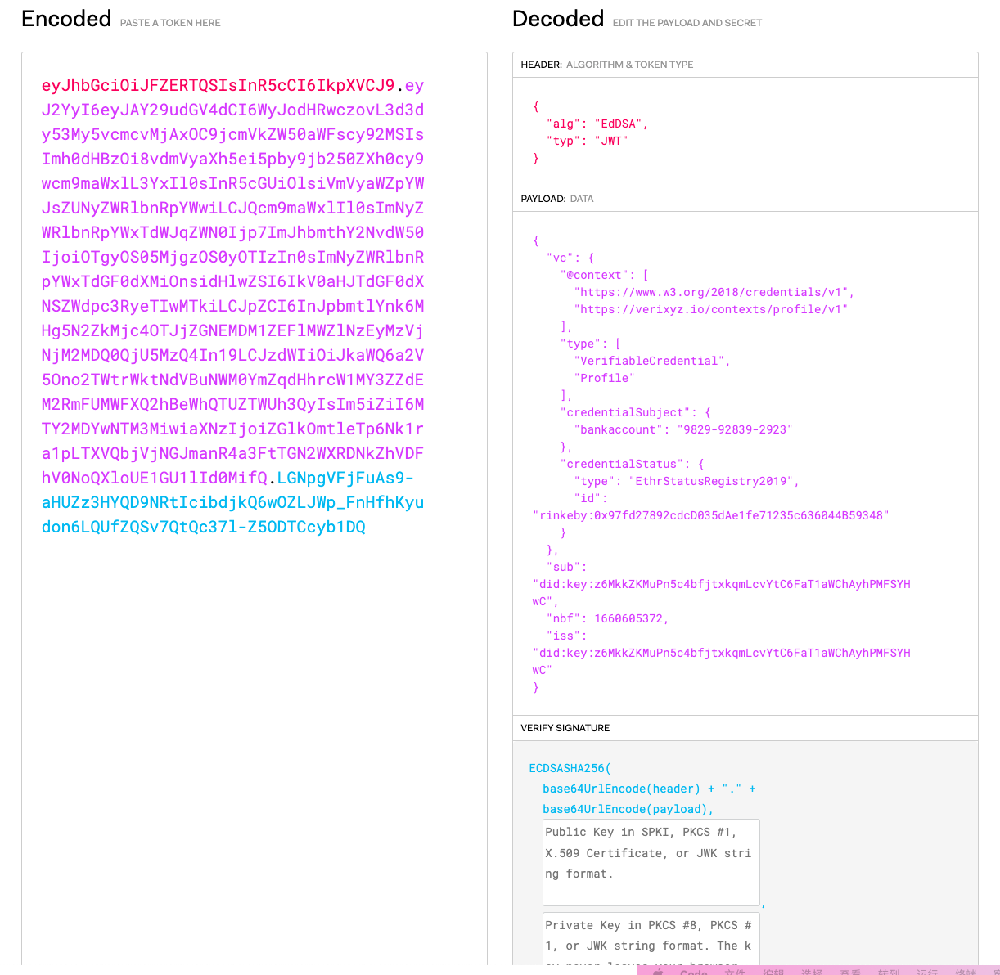

# Credential 
A [verifiable credential](https://www.w3.org/TR/vc-data-model/#dfn-verifiable-credentials) contains [claims](https://www.w3.org/TR/vc-data-model/#dfn-claims) about one or more [subjects](https://www.w3.org/TR/vc-data-model/#dfn-subjects). This specification defines a `credentialSubject` [property](https://www.w3.org/TR/vc-data-model/#dfn-property) for the expression of [claims](https://www.w3.org/TR/vc-data-model/#dfn-claims) about one or more [subjects](https://www.w3.org/TR/vc-data-model/#dfn-subjects).

A [verifiable credential](https://www.w3.org/TR/vc-data-model/#dfn-verifiable-credentials) *MUST* have a `credentialSubject` [property](https://www.w3.org/TR/vc-data-model/#dfn-property).

- credentialSubject

  The value of the `credentialSubject` [property](https://www.w3.org/TR/vc-data-model/#dfn-property) is defined as a set of objects that contain one or more properties that are each related to a [subject](https://www.w3.org/TR/vc-data-model/#dfn-subjects) of the [verifiable credential](https://www.w3.org/TR/vc-data-model/#dfn-verifiable-credentials). Each object *MAY* contain an `id`, as described in Section [4.2 Identifiers](https://www.w3.org/TR/vc-data-model/#identifiers).

## How to create credentials

Use verixyz create new credentials, the first things is to choose some options:

- Credential proofFormat: [jwt](https://www.rfc-editor.org/rfc/rfc7519) or [JSON-LD](https://www.rfc-editor.org/rfc/rfc8259);
- Issuer DID: a issuers's DID;
- Subejct DID: 
- Credential Type: VerifiableCredential, Profile
- Claim Type: 
- Claim Value:
- Credential Revocable: Y/N
- Credential status type: 
- Credential Status ID:

Then, one can create a credntial using 
```bash
$ verixyz credental create` 
```

The output from abve command, should be like this:

```json

? Credential proofFormat jwt
? Issuer DID did:key:z6MkkZKMuPn5c4bfjtxkqmLcvYtC6FaT1aWChAyhPMFSYHwC jerry
? Subject DID did:key:z6MkkZKMuPn5c4bfjtxkqmLcvYtC6FaT1aWChAyhPMFSYHwC
? Credential Type VerifiableCredential,Profile
? Claim Type bankaccount
? Claim Value 9829-92839-2923
? Is the credential revocable? Yes
? Credential status type EthrStatusRegistry2019
? Credential status ID rinkeby:0x97fd27892cdcD035dAe1fe71235c636044B59348
{
  credentialSubject: {
    bankaccount: '9829-92839-2923',
    id: 'did:key:z6MkkZKMuPn5c4bfjtxkqmLcvYtC6FaT1aWChAyhPMFSYHwC'
  },
  issuer: { id: 'did:key:z6MkkZKMuPn5c4bfjtxkqmLcvYtC6FaT1aWChAyhPMFSYHwC' },
  type: [ 'VerifiableCredential', 'Profile' ],
  credentialStatus: {
    type: 'EthrStatusRegistry2019',
    id: 'rinkeby:0x97fd27892cdcD035dAe1fe71235c636044B59348'
  },
  '@context': [
    'https://www.w3.org/2018/credentials/v1',
    'https://verixyz.io/contexts/profile/v1'
  ],
  issuanceDate: '2022-08-15T23:16:12.000Z',
  proof: {
    type: 'JwtProof2020',
    jwt: 'eyJhbGciOiJFZERTQSIsInR5cCI6IkpXVCJ9.eyJ2YyI6eyJAY29udGV4dCI6WyJodHRwczovL3d3dy53My5vcmcvMjAxOC9jcmVkZW50aWFscy92MSIsImh0dHBzOi8vdmVyaXh5ei5pby9jb250ZXh0cy9wcm9maWxlL3YxIl0sInR5cGUiOlsiVmVyaWZpYWJsZUNyZWRlbnRpYWwiLCJQcm9maWxlIl0sImNyZWRlbnRpYWxTdWJqZWN0Ijp7ImJhbmthY2NvdW50IjoiOTgyOS05MjgzOS0yOTIzIn0sImNyZWRlbnRpYWxTdGF0dXMiOnsidHlwZSI6IkV0aHJTdGF0dXNSZWdpc3RyeTIwMTkiLCJpZCI6InJpbmtlYnk6MHg5N2ZkMjc4OTJjZGNEMDM1ZEFlMWZlNzEyMzVjNjM2MDQ0QjU5MzQ4In19LCJzdWIiOiJkaWQ6a2V5Ono2TWtrWktNdVBuNWM0YmZqdHhrcW1MY3ZZdEM2RmFUMWFXQ2hBeWhQTUZTWUh3QyIsIm5iZiI6MTY2MDYwNTM3MiwiaXNzIjoiZGlkOmtleTp6Nk1ra1pLTXVQbjVjNGJmanR4a3FtTGN2WXRDNkZhVDFhV0NoQXloUE1GU1lId0MifQ.LGNpgVFjFuAs9-aHUZz3HYQD9NRtIcibdjkQ6wOZLJWp_FnHfhKyudon6LQUfZQSv7QtQc37l-Z5ODTCcyb1DQ'
  }
}
```

if one choose JSON-LD, the output should like this:
```json
 Credential proofFormat lds
? Issuer DID did:key:z6MkkZKMuPn5c4bfjtxkqmLcvYtC6FaT1aWChAyhPMFSYHwC jerry
? Subject DID did:key:z6MkkZKMuPn5c4bfjtxkqmLcvYtC6FaT1aWChAyhPMFSYHwC
? Credential Type VerifiableCredential,Profile
? Claim Type name
? Claim Value Alice
? Is the credential revocable? Yes
? Credential status type EthrStatusRegistry2019
? Credential status ID rinkeby:0x97fd27892cdcD035dAe1fe71235c636044B59348
{
  issuer: { id: 'did:key:z6MkkZKMuPn5c4bfjtxkqmLcvYtC6FaT1aWChAyhPMFSYHwC' },
  '@context': [
    'https://www.w3.org/2018/credentials/v1',
    'https://verixyz.io/contexts/profile/v1'
  ],
  type: [ 'VerifiableCredential', 'Profile' ],
  issuanceDate: '2022-08-15T23:41:11.529Z',
  credentialSubject: {
    id: 'did:key:z6MkkZKMuPn5c4bfjtxkqmLcvYtC6FaT1aWChAyhPMFSYHwC',
    name: 'Alice'
  },
  credentialStatus: {
    type: 'EthrStatusRegistry2019',
    id: 'rinkeby:0x97fd27892cdcD035dAe1fe71235c636044B59348'
  },
  proof: {
    type: 'Ed25519Signature2018',
    created: '2022-08-15T23:41:13Z',
    verificationMethod: 'did:key:z6MkkZKMuPn5c4bfjtxkqmLcvYtC6FaT1aWChAyhPMFSYHwC#z6MkkZKMuPn5c4bfjtxkqmLcvYtC6FaT1aWChAyhPMFSYHwC',
    proofPurpose: 'assertionMethod',
    jws: 'eyJhbGciOiJFZERTQSIsImI2NCI6ZmFsc2UsImNyaXQiOlsiYjY0Il19.._cWL-P0JoLgWwO9uweNPSufrMj4IpN1A7DRLKvrjH3ZuaLt8dkDBDz-Y3M6SclBPfEc9k5l0m5tVtIeHL52FDQ'
  }
}
```


> NOTICE: JWT is not encrypted by default. Everyone can use  [jwt tools](https://jwt.io/) to decode the JWT. So, one should choose if encode its claim or not.




