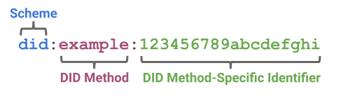

# DID Metholds
A DID method defines how implementers can realize the features described by this specification. DID methods are often associated with a particular verifiable data registry. New DID methods are defined in their own specifications to enable interoperability between different implementations of the same DID method. See [DID Methods W3C Spec](https://www.w3.org/TR/did-core/#methods).


## A DID Simple Example
A DID is a simple text string consisting of three parts: 1) the `did` URI scheme identifier, 2) the identifier for the `DID method`, and 3) the DID method-specific identifier.


The example DID above resolves to a DID document. A DID document contains information associated with the DID, such as ways to cryptographically authenticate a DID controller.
```json
EXAMPLE 1: A simple DID document
{
  "@context": [
    "https://www.w3.org/ns/did/v1",
    "https://w3id.org/security/suites/ed25519-2020/v1"
  ]
  "id": "did:example:123456789abcdefghi",
  "authentication": [{
    
    "id": "did:example:123456789abcdefghi#keys-1",
    "type": "Ed25519VerificationKey2020",
    "controller": "did:example:123456789abcdefghi",
    "publicKeyMultibase": "zH3C2AVvLMv6gmMNam3uVAjZpfkcJCwDwnZn6z3wXmqPV"
  }]
}
```

## Universal Resolver
[Universal Resolver](https://dev.uniresolver.io/) is managed by [DIF](https://identity.foundation/), which support global DID metholds.There are still some private DID metholds which could be used in private.

The `Universal Resolver` wraps an API around a number of co-located Docker containers running DID-method-specific drivers. Additional DID methods can be supported as they are developed by the community. The contribution for a new DID method driver consists of a Docker image which exposes an HTTP interface for resolving DIDs. New contributions are submitted as Pull Requests to the [Universal Resolver repository](https://github.com/decentralized-identity/universal-resolver.git).

One can add new driver(did metholds) to `Universal Resolver`supported DID metholds.

DIF Supported DID Metholds should be find [here](https://dev.uniresolver.io/).


## Verixyz DID Metholds
Verixyz will constantly develop pulgins that support the global DID metholds above.
 
- [did:ethr](https://github.com/decentralized-identity/ethr-did-resolver/blob/master/doc/did-method-spec.md)
- [did:web](https://w3c-ccg.github.io/did-method-web/)
- [did:key](https://w3c-ccg.github.io/did-method-key/)

## Development on Demand
A DID metholds should be deveolped on demand. 