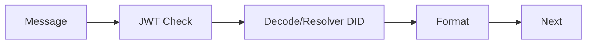
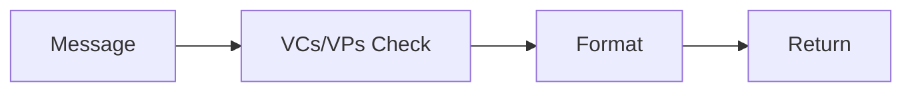
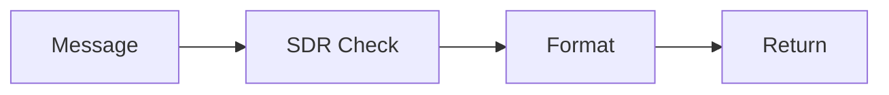

# Messages
Verixyz can communicate with other systems using it's messaging system. The messaging system is comprised of a Message Type, a MessageHandler interface, a MessageHandler plugin that accepts multiple message parsers plugins that implement `AbstractMessageHandler` You can create custom message handling plugins to add new message types for your agent.


```mermaid
classDiagram
    IMessageHandler{MessageHandler} <|-- W3CMessageHandler
    IMessageHandler{MessageHandler} <|-- JWTMessageHandler
    IMessageHandler{MessageHandler} <|-- DIDComm MessageHandler
    IMessageHandler{MessageHandler} <|-- SDR MessageHandler
```

## Handling Messages
A message can be introduced to the `Agent` in a number of ways including via REST endpoint if you are using Verixyz Server or by scanning a QR code if you are using Verixyz Client on mobile. The MessageHandler's main responsibility is to try to convert incoming messages to the correct data model so they can be understood by Verixyz and optionally be stored for later use.

When you bootstrap a Verixyz Agent you will have something that looks like this:
```js
const agent = new Agent({
  plugins: [
    new MessageHandler({
      messageHandlers: [
        new DIDCommMessageHandler(),
        new JwtMessageHandler(),
        new W3cMessageHandler(),
        new SdrMessageHandler(),
      ],
    }),
  ],
})
```
The `MessageHandler` plugin is instantiated with message parsers. These parsers implement the `AbstractMessageHandler` interface. The `MessageHandler` plugin adds a handleMessage method to the `agent` and can be invoked by calling `agent.handleMessage()`. Regardless of what configuration your agent is in this method is the entry-point for all messages.

When the `MessageHandler` is instantiated it creates a chain of message parsers (`AbstractMessageHandler`) in the exact order specified in the configuration.


## Message Handlers
Message handlers implement the `AbstractMessageHandler` interface and are instantiated as a chain by the Message Handler plugin. Verixyz includes a number of message handlers for you to use in your apps.

### Supported Message Handlers
- did-comm
`DIDCommMessageHandler` decrypts incoming messages using the private key of the recipient. The decrypted jwt is passed along to the JWT Message Handler.

- did-jwt
`JWTMessageHandler` takes a JWT and creates a message object.


- credential-w3c
`W3CMessageHandler` checks the message payload for Verifiable Credentials and Verifiable Presentations and formats the message object accordingly.


- selective-disclosure
`SDRMessageHandler` checks the message payload for Selective Disclosure Request formats the message object accordingly. Learn more about selective disclosure requests in the next section.



