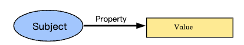
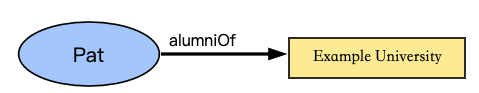
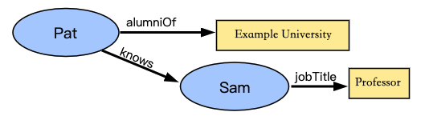
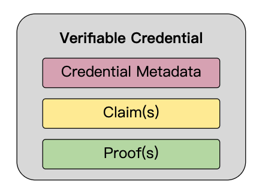
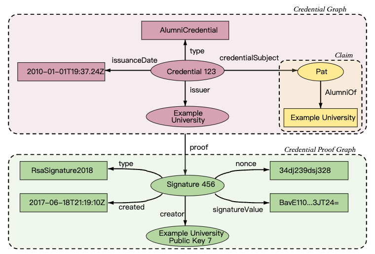
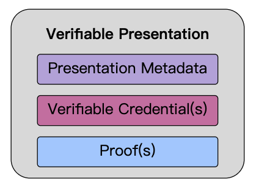
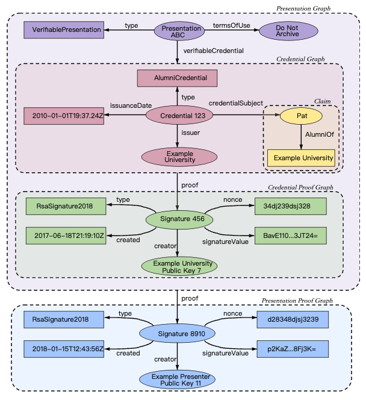
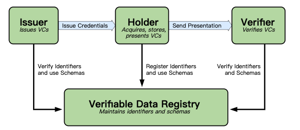

# Verifiable Data
Verifiable data is simply data that has been digitally signed using a cryptographic algorithm. If data has been signed in this way, someone can verify the signature. Here we can look a the most common standard of verifiable data - `VCss`.

## W3C VCs
To summarise the W3C definition of a `VCs`(VCs), it is a piece of data that conforms to the VerifiableCredential type. It has attributes such as issuer, subject, proofs, and data being made verifiable. Like a physical credential, a VCs is issued from one entity known as the issuer to another entity, the subject.

W3C release a recommdendation of [VCs data modle](https://www.w3.org/TR/vc-data-model/). This is the current `v1.1` format for a W3C compliant VCs:

```json
EXAMPLE 1: A simple example of a VCs
{
  
  "@context": [
    "https://www.w3.org/2018/credentials/v1",
    "https://www.w3.org/2018/credentials/examples/v1"
  ],
  
  "id": "http://example.edu/credentials/1872",
  
  "type": ["VerifiableCredential", "AlumniCredential"],
  
  "issuer": "https://example.edu/issuers/565049",
  
  "issuanceDate": "2010-01-01T19:23:24Z",
  
  "credentialSubject": {
    
    "id": "did:example:ebfeb1f712ebc6f1c276e12ec21",
    
    "alumniOf": {
      "id": "did:example:c276e12ec21ebfeb1f712ebc6f1",
      "name": [{
        "value": "Example University",
        "lang": "en"
      }, {
        "value": "Exemple d'Université",
        "lang": "fr"
      }]
    }
  },
  
  
  "proof": {
    
    "type": "RsaSignature2018",
    
    "created": "2017-06-18T21:19:10Z",
    
    "proofPurpose": "assertionMethod",
    
    "verificationMethod": "https://example.edu/issuers/565049#key-1",
    
    "jws": "eyJhbGciOiJSUzI1NiIsImI2NCI6ZmFsc2UsImNyaXQiOlsiYjY0Il19..TCYt5X
      sITJX1CxPCT8yAV-TVkIEq_PbChOMqsLfRoPsnsgw5WEuts01mq-pQy7UJiN5mgRxD-WUc
      X16dUEMGlv50aqzpqh4Qktb3rk-BuQy72IFLOqV0G_zS245-kronKb78cPN25DGlcTwLtj
      PAYuNzVBAh4vGHSrQyHUdBBPM"
  }
}
```
## The Core Concept about VCs

### Claim
A claim is a statement about a subject. A subject is a thing about which claims can be made. Claims are expressed using `subject-property-value` relationships.



The data model for claims, illustrated in Fig1 above, is powerful and can be used to express a large variety of statements. For example, whether someone graduated from a particular university can be expressed as shown in Fig2 below.



Individual claims can be merged together to express a graph of information about a subject. The example shown in Fig3 below extends the previous claim by adding the claims that Pat knows Sam and that Sam is employed as a professor.



To this point, the concepts of a claim and a graph of information are introduced. To be able to **trust claims**, `more information is expected to be added to the graph`. 

We will see how VCs make claims be trusted using following basic build blocks:
- Verifibale Credentials 
- Verifibale Data Registry
- DID


### Verifibale Credentials
A credential is a set of one or more claims made by the same entity. Credentials might also include an identifier and metadata to describe properties of the credential, such as the issuer, the expiry date and time, a representative image, a public key to use for verification purposes, the revocation mechanism, and so on. The metadata might be signed by the issuer. A VCs is a set of tamper-evident claims and metadata that cryptographically prove who issued it.`

Basic components of a VCs include: Credential Metadata, Claim(s) and Proof(s). 


Examples of VCs include digital employee identification cards, digital birth certificates, and digital educational certificates.

> NOTE: Credential identifiers are often used to identify specific instances of a credential. These identifiers can also be used for correlation. A holder wanting to minimize correlation is advised to use a selective disclosure scheme that does not reveal the credential identifier.

Fig5 above shows the basic components of a VCs, but abstracts the details about how claims are organized into information graphs, which are then organized into VCss. Fig6 below shows a more complete depiction of a VCs, which is normally composed of at least two information graphs. The first graph expresses the VCs itself, which contains credential metadata and claims. The second graph expresses the digital proof, which is usually a digital signature.


### Presentations

**Enhancing privacy** is a key design feature of this specification. Therefore, it is important for entities using this technology to be able to express only the portions of their persona that are appropriate for a given situation. The expression of a subset of one's persona is called a `verifiable presentation`. Examples of different personas include a person's professional persona, their online gaming persona, their family persona, or an incognito persona.

A verifiable presentation expresses data from one or more verifiable credentials, and is packaged in such a way that the authorship of the data is verifiable. If verifiable credentials are presented directly, they become verifiable presentations. Data formats derived from verifiable credentials that are cryptographically verifiable, but do not of themselves contain verifiable credentials, might also be verifiable presentations.

The data in a presentation is often about the same subject, but might have been issued by multiple issuers. The aggregation of this information typically expresses an aspect of a person, organization, or entity.



Fig7 above shows the components of a verifiable presentation, but abstracts the details about how verifiable credentials are organized into information graphs, which are then organized into verifiable presentations.

Fig8 below shows a more complete depiction of a verifiable presentation, which is normally composed of at least four information graphs. The first of these information graphs, the Presentation Graph, expresses the verifiable presentation itself, which contains presentation metadata. The verifiableCredential property in the Presentation Graph refers to one or more verifiable credentials, each being one of the second information graphs, i.e., a self-contained Credential Graph, which in turn contains credential metadata and claims. The third information graph, the Credential Proof Graph, expresses the credential graph proof, which is usually a digital signature. The fourth information graph, the Presentation Proof Graph, expresses the presentation graph proof, which is usually a digital signature.



> NOTE: It is possible to have a presentation, such as a business persona, which draws on multiple credentials about different subjects that are often, but not required to be, related.


### Verifiable Data Registry
A role a system might perform by mediating the creation and verification of identifiers, keys, and other relevant data, such as verifiable credential schemas, revocation registries, issuer public keys, and so on, which might be required to use verifiable credentials. Some configurations might require correlatable identifiers for subjects. Example verifiable data registries include trusted databases, decentralized databases, government ID databases, and distributed ledgers. Often there is more than one type of verifiable data registry utilized in an ecosystem.


> NOTE: Figure above provides an example ecosystem in which to ground the rest of the concepts in this specification. Other ecosystems exist, such as protected environments or proprietary systems, where VCs also provide benefit.

## Lifecycle Example

The lifecycle of credentials and presentations in the Verifiable Credentials Ecosystem often take a common path:
1. Issuance of one or more verifiable credentials.
2. Storage of verifiable credentials in a credential repository (such as a digital wallet).
3. Composition of verifiable credentials into a verifiable presentation for verifiers.
4. Verification of the verifiable presentation by the verifier.

To illustrate this lifecycle, we will use the example of redeeming an alumni discount from a university. In the example below, Pat receives an alumni verifiable credential from a university, and Pat stores the verifiable credential in a digital wallet.

```json
EXAMPLE 1: A simple example of a verifiable credential
{
  
  "@context": [
    "https://www.w3.org/2018/credentials/v1",
    "https://www.w3.org/2018/credentials/examples/v1"
  ],
  
  "id": "http://example.edu/credentials/1872",
  
  "type": ["VerifiableCredential", "AlumniCredential"],
  
  "issuer": "https://example.edu/issuers/565049",
  
  "issuanceDate": "2010-01-01T19:23:24Z",
  
  "credentialSubject": {
    
    "id": "did:example:ebfeb1f712ebc6f1c276e12ec21",
    
    "alumniOf": {
      "id": "did:example:c276e12ec21ebfeb1f712ebc6f1",
      "name": [{
        "value": "Example University",
        "lang": "en"
      }, {
        "value": "Exemple d'Université",
        "lang": "fr"
      }]
    }
  },
  
  
  "proof": {
    
    "type": "RsaSignature2018",
    
    "created": "2017-06-18T21:19:10Z",
    
    "proofPurpose": "assertionMethod",
    
    "verificationMethod": "https://example.edu/issuers/565049#key-1",
    
    "jws": "eyJhbGciOiJSUzI1NiIsImI2NCI6ZmFsc2UsImNyaXQiOlsiYjY0Il19..TCYt5X
      sITJX1CxPCT8yAV-TVkIEq_PbChOMqsLfRoPsnsgw5WEuts01mq-pQy7UJiN5mgRxD-WUc
      X16dUEMGlv50aqzpqh4Qktb3rk-BuQy72IFLOqV0G_zS245-kronKb78cPN25DGlcTwLtj
      PAYuNzVBAh4vGHSrQyHUdBBPM"
  }
}
```
Pat then attempts to redeem the alumni discount. The verifier, a ticket sales system, states that any alumni of "Example University" receives a discount on season tickets to sporting events. Using a mobile device, Pat starts the process of purchasing a season ticket. A step in this process requests an alumni verifiable credential, and this request is routed to Pat's digital wallet. The digital wallet asks Pat if they would like to provide a previously issued verifiable credential. Pat selects the alumni verifiable credential, which is then composed into a verifiable presentation. The verifiable presentation is sent to the verifier and verified.

```json
EXAMPLE 2: A simple example of a verifiable presentation
{
  "@context": [
    "https://www.w3.org/2018/credentials/v1",
    "https://www.w3.org/2018/credentials/examples/v1"
  ],
  "type": "VerifiablePresentation",
  
  "verifiableCredential": [{
    "@context": [
      "https://www.w3.org/2018/credentials/v1",
      "https://www.w3.org/2018/credentials/examples/v1"
    ],
    "id": "http://example.edu/credentials/1872",
    "type": ["VerifiableCredential", "AlumniCredential"],
    "issuer": "https://example.edu/issuers/565049",
    "issuanceDate": "2010-01-01T19:23:24Z",
    "credentialSubject": {
      "id": "did:example:ebfeb1f712ebc6f1c276e12ec21",
      "alumniOf": {
        "id": "did:example:c276e12ec21ebfeb1f712ebc6f1",
        "name": [{
          "value": "Example University",
          "lang": "en"
        }, {
          "value": "Exemple d'Université",
          "lang": "fr"
        }]
      }
    },
    "proof": {
      "type": "RsaSignature2018",
      "created": "2017-06-18T21:19:10Z",
      "proofPurpose": "assertionMethod",
      "verificationMethod": "https://example.edu/issuers/565049#key-1",
      "jws": "eyJhbGciOiJSUzI1NiIsImI2NCI6ZmFsc2UsImNyaXQiOlsiYjY0Il19..TCYt5X
        sITJX1CxPCT8yAV-TVkIEq_PbChOMqsLfRoPsnsgw5WEuts01mq-pQy7UJiN5mgRxD-WUc
        X16dUEMGlv50aqzpqh4Qktb3rk-BuQy72IFLOqV0G_zS245-kronKb78cPN25DGlcTwLtj
        PAYuNzVBAh4vGHSrQyHUdBBPM"
    }
  }],
  
  "proof": {
    "type": "RsaSignature2018",
    "created": "2018-09-14T21:19:10Z",
    "proofPurpose": "authentication",
    "verificationMethod": "did:example:ebfeb1f712ebc6f1c276e12ec21#keys-1",
    
    "challenge": "1f44d55f-f161-4938-a659-f8026467f126",
    "domain": "4jt78h47fh47",
    "jws": "eyJhbGciOiJSUzI1NiIsImI2NCI6ZmFsc2UsImNyaXQiOlsiYjY0Il19..kTCYt5
      XsITJX1CxPCT8yAV-TVIw5WEuts01mq-pQy7UJiN5mgREEMGlv50aqzpqh4Qq_PbChOMqs
      LfRoPsnsgxD-WUcX16dUOqV0G_zS245-kronKb78cPktb3rk-BuQy72IFLN25DYuNzVBAh
      4vGHSrQyHUGlcTwLtjPAnKb78"
  }
}
```
There are another concepts involved in VCs Ecosystems. If you want know more details, please see the [offical documents](https://www.w3.org/TR/vc-data-model/).


